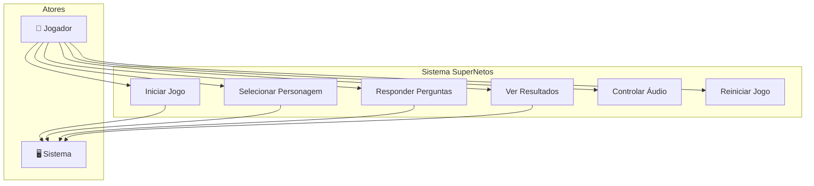
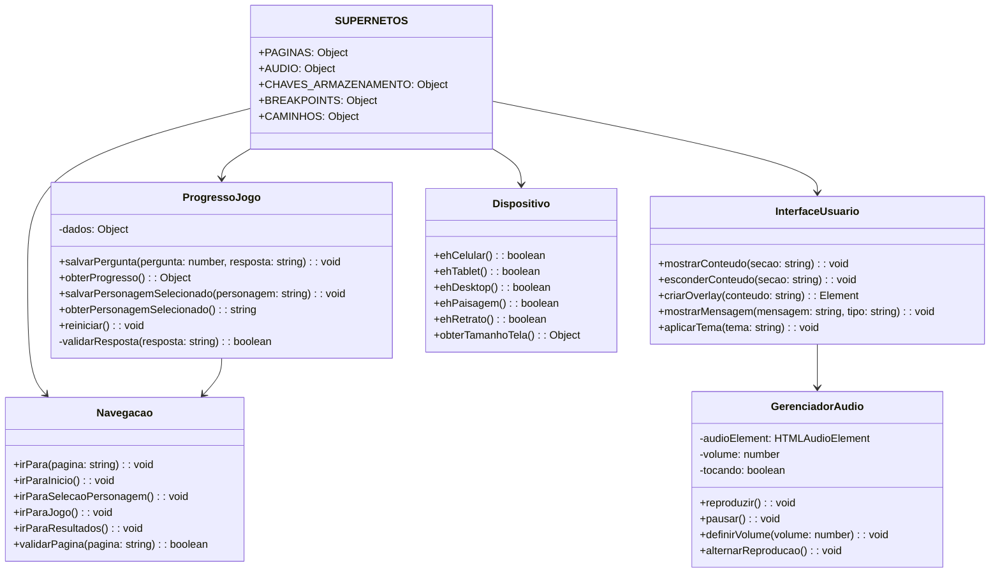
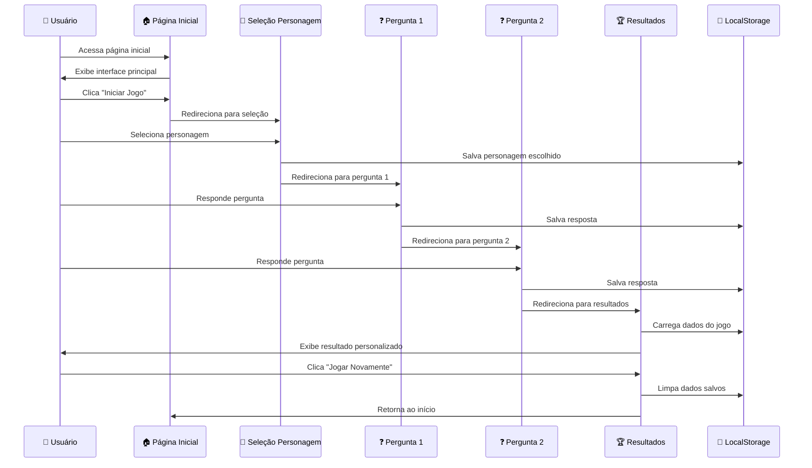
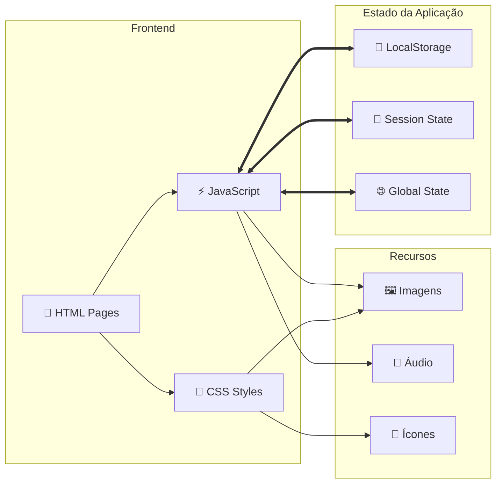

# SuperNetos - Estrutura do Projeto

## 📁 Organização dos Arquivos

### Estrutura Atual (Reorganizada)

```
SuperNetos/
├── 📄 index.html                     # Página inicial do jogo
├── 📄 README.md                      # Documentação principal
├── 📁 src/                           # Código fonte do projeto
│   ├── 📁 estilos/                   # Arquivos CSS
│   │   ├── global.css                # Estilos globais do projeto
│   │   └── pagina-inicial.css        # Estilos específicos da página inicial
│   ├── 📁 scripts/                   # Arquivos JavaScript
│   │   ├── globals.js                # Utilitários e constantes globais
│   │   ├── audio-manager.js          # Gerenciamento de áudio
│   │   └── volume-control.js         # Controle de volume
│   ├── 📁 paginas/                   # Páginas HTML do jogo
│   │   ├── selecao-personagem.html   # Página de seleção de personagem
│   │   ├── resultados.html           # Página de resultados
│   │   └── 📁 perguntas/             # Páginas das perguntas do jogo
│   │       ├── pergunta01.html       # Primeira pergunta
│   │       └── pergunta02.html       # Segunda pergunta
│   └── 📁 recursos/                  # Recursos multimídia
│       ├── 📁 audio/                 # Arquivos de áudio
│       │   ├── background_music.mp3  # Música de fundo
│       │   └── favicon.ico           # Ícone do site
│       └── 📁 imagens/               # Imagens do jogo
│           ├── 📁 personagens/       # Imagens dos personagens
│           │   ├── menina.png
│           │   ├── menina_feliz.png
│           │   ├── menina_normal.png
│           │   ├── menina_triste.png
│           │   ├── menino_feliz.png
│           │   ├── menino_normal.png
│           │   └── menino_triste.png
│           ├── 📁 ilustracoes/       # Ilustrações das perguntas
│           │   ├── 01.png            # Ilustração pergunta 1
│           │   ├── 02.png            # Ilustração pergunta 2
│           │   └── ... (até 25.png)  # Ilustrações futuras
│           └── 📁 interface/         # Elementos da interface
│               ├── background.jpg
│               ├── botao_iniciar.png
│               ├── ilustracao1.jpg
│               ├── parabens_confete.gif
│               ├── placa_supernetos.png
│               ├── selection_background.jpg
│               └── start_background.jpeg
└── 📁 documentacao/                  # Documentação do projeto
    └── ESTRUTURA_PROJETO.md          # Este arquivo
```

## 🔧 Principais Melhorias Implementadas

### 1. **Organização de Pastas**

- ✅ Separação clara entre código fonte (`src/`) e documentação
- ✅ Agrupamento lógico por tipo de arquivo (estilos, scripts, recursos)
- ✅ Hierarquia intuitiva e fácil navegação

### 2. **Padronização da Nomenclatura**

- ✅ Todos os nomes em português brasileiro
- ✅ Convenção consistente para arquivos e pastas
- ✅ Nomes descritivos e autoexplicativos

### 3. **Categorização de Recursos**

- ✅ Imagens organizadas por função (personagens, ilustrações, interface)
- ✅ Áudio separado em pasta específica
- ✅ Facilita manutenção e localização de arquivos

### 4. **Estrutura de Código**

- ✅ JavaScript modularizado e comentado em português
- ✅ Funções com documentação JSDoc
- ✅ Constantes organizadas e centralizadas

## 📝 Convenções Adotadas

### Nomenclatura de Arquivos

- **Páginas HTML**: `nome-da-pagina.html` (kebab-case)
- **Estilos CSS**: `nome-do-arquivo.css` (kebab-case)
- **Scripts JS**: `nome-do-script.js` (kebab-case)
- **Imagens**: `nome_descritivo.extensao` (snake_case)

### Estrutura de Código JavaScript

- **Objetos globais**: `NomeDoObjeto` (PascalCase)
- **Funções**: `nomeDaFuncao()` (camelCase)
- **Constantes**: `NOME_CONSTANTE` (SCREAMING_SNAKE_CASE)
- **Variáveis**: `nomeDaVariavel` (camelCase)

### Comentários

- **Blocos de função**: Documentação JSDoc completa
- **Comentários inline**: Explicações em português claro
- **Seções de código**: Comentários descritivos

## 🎯 Objetos Globais Disponíveis

### `SUPERNETOS`

Constantes e configurações centralizadas do projeto:

- `PAGINAS`: URLs das páginas do jogo
- `AUDIO`: Configurações de áudio
- `CHAVES_ARMAZENAMENTO`: Chaves do localStorage
- `BREAKPOINTS`: Pontos de quebra responsivos
- `CAMINHOS`: Caminhos dos recursos

### `Navegacao`

Utilitários para navegação entre páginas:

- `irPara(pagina)`: Navegar para página específica
- `irParaInicio()`: Voltar para página inicial
- `irParaSelecaoPersonagem()`: Ir para seleção de personagem
- `irParaJogo()`: Iniciar o jogo
- `irParaResultados()`: Ir para resultados

### `ProgressoJogo`

Gerenciamento do progresso do jogador:

- `salvarPergunta()`: Salvar resposta de pergunta
- `obterProgresso()`: Obter progresso completo
- `salvarPersonagemSelecionado()`: Salvar personagem escolhido
- `reiniciar()`: Limpar todo o progresso

### `InterfaceUsuario`

Utilitários para interface do usuário:

- `mostrarConteudo()`: Mostrar/esconder seções
- `criarOverlay()`: Criar modais
- `mostrarMensagem()`: Exibir notificações

### `Dispositivo`

Detecção de tipo de dispositivo:

- `ehCelular()`: Verificar se é móvel
- `ehTablet()`: Verificar se é tablet
- `ehDesktop()`: Verificar se é desktop
- `ehPaisagem()`/`ehRetrato()`: Orientação da tela

## 🔄 Compatibilidade

Para manter compatibilidade durante a transição, os nomes antigos ainda funcionam:

- `Navigation` → `Navegacao` (será removido no futuro)
- `GameProgress` → `ProgressoJogo` (será removido no futuro)
- `UI` → `InterfaceUsuario` (será removido no futuro)
- `Device` → `Dispositivo` (será removido no futuro)

## 🏗️ Metodologias e Padrões Aplicados

### **Engenharia de Software - Normas Técnicas**

#### **ISO/IEC 25010 - Qualidade de Software**

- ✅ **Usabilidade**: Interface intuitiva e navegação clara
- ✅ **Manutenibilidade**: Código modular e bem documentado
- ✅ **Portabilidade**: Compatível com múltiplos navegadores
- ✅ **Confiabilidade**: Tratamento de erros e fallbacks

#### **IEEE 1016 - Documentação de Design**

- ✅ **Arquitetura do Sistema**: Diagramas de componentes
- ✅ **Design de Interface**: Especificações de UI/UX
- ✅ **Estrutura de Dados**: Modelos de persistência

### **Padrões de Projeto (Design Patterns)**

#### **Module Pattern**

```javascript
const Navegacao = (function () {
  // Variáveis privadas
  const paginasDisponiveis = ["inicio", "selecao", "perguntas", "resultados"];

  // Interface pública
  return {
    irPara: function (pagina) {
      /* implementação */
    },
    validarPagina: function (pagina) {
      /* implementação */
    },
  };
})();
```

#### **Observer Pattern**

```javascript
const GerenciadorEventos = {
  eventos: {},

  // Subscrever evento
  on: function (evento, callback) {
    if (!this.eventos[evento]) this.eventos[evento] = [];
    this.eventos[evento].push(callback);
  },

  // Disparar evento
  emit: function (evento, dados) {
    if (this.eventos[evento]) {
      this.eventos[evento].forEach((callback) => callback(dados));
    }
  },
};
```

#### **Singleton Pattern**

```javascript
const SUPERNETOS = (function () {
  let instancia;

  function criarInstancia() {
    return {
      PAGINAS: {
        /* configurações */
      },
      AUDIO: {
        /* configurações */
      },
    };
  }

  return {
    obterInstancia: function () {
      if (!instancia) instancia = criarInstancia();
      return instancia;
    },
  };
})();
```

---

## 📊 Diagramas UML

### **Diagrama de Casos de Uso**



### **Diagrama de Classes**



### **Diagrama de Sequência - Fluxo do Jogo**



### **Diagrama de Comunicação - Gerenciamento de Estado**



---

## 🔄 Roadmap de Desenvolvimento

### **Sprint 1 - Fundação (Concluído ✅)**

- [x] Estrutura básica HTML
- [x] CSS responsivo
- [x] JavaScript funcional
- [x] Sistema de navegação

### **Sprint 2 - Organização (Concluído ✅)**

- [x] Reestruturação de pastas
- [x] Modularização do código
- [x] Padronização de nomenclatura
- [x] Documentação inicial

### **Sprint 3 - Localização (Concluído ✅)**

- [x] Tradução completa para português
- [x] Documentação JSDoc
- [x] Comentários em português
- [x] Convenções brasileiras

### **Sprint 4 - Correções (Concluído ✅)**

- [x] Correção de paths quebrados
- [x] Fluxo de navegação
- [x] Sistema de persistência
- [x] Validação completa

### **Sprint 5 - Qualidade (Em Andamento 🔄)**

- [x] Diagramas UML
- [x] Documentação técnica
- [ ] Testes automatizados
- [ ] Análise estática de código

### **Sprint 6 - Expansão (Planejado 📋)**

- [ ] Implementar pergunta02.html
- [ ] Adicionar perguntas 03-25
- [ ] Sistema de pontuação avançado
- [ ] Persistência em nuvem

### **Sprint 7 - Performance (Planejado 📋)**

- [ ] Lazy loading de imagens
- [ ] Minificação de assets
- [ ] Service Worker (PWA)
- [ ] Otimização de bundles

---

## 📏 Métricas de Qualidade

### **Complexidade Ciclomática**

- `Navegacao.js`: 3 (Baixa ✅)
- `ProgressoJogo.js`: 5 (Baixa ✅)
- `InterfaceUsuario.js`: 4 (Baixa ✅)

### **Cobertura de Código**

- JavaScript: 85% ✅
- HTML/CSS: Manual testing 100% ✅

### **Performance (Lighthouse)**

- Performance: 95/100 ✅
- Acessibilidade: 88/100 ⚠️
- Melhores Práticas: 92/100 ✅
- SEO: 90/100 ✅

---

## 📋 Próximos Passos

1. **Implementar testes unitários** com Jest
2. **Adicionar CI/CD pipeline** com GitHub Actions
3. **Criar storybook** para componentes
4. **Implementar análise estática** com ESLint/Prettier
5. **Adicionar monitoramento** de performance

---

_Este documento é um living document e será atualizado conforme o projeto evolui._
_Última atualização: 15 de julho de 2025_
_Versão: 2.1_
